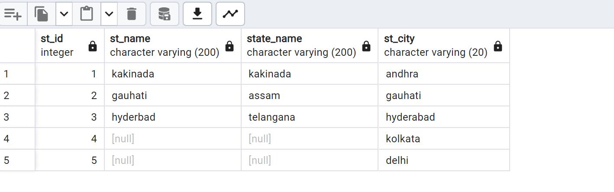

##### List the all DB's #####

    \l

#### Create a DB ####

    create database demodb;

#### Checkout to created database ####

    \c demodb

#### Delete DB ####

    drop database demodb;

#### Check list of tables ####

    step1: login to db => \c demodb
    \d

#### Create a table ####

    create table student(id int,name text,age int,address text);
    (or)
    create table station(
	st_id integer,
	st_name varchar(200),
	st_state varchar(200),
	st_city varchar(20)
    );

#### Delete a table ####

    single: drop table <tablename>; 
    multiple: drop table<tablename>,<tablename>;

#### Alter table ####
    Notes: 
    alter means modification of table we can rename or add colums on table
    step1: create a sample table on testdb

    create table station(
	st_id integer,
	st_name varchar(200),
	st_state varchar(200),
	st_city varchar(20)
    );

    step2: altering adding the another column in table

    alter table station
    add column latitude real;

    task2: drop table using alter let say i have 5 cloumns i do want drop one column

    alter table station
    drop column latitude;

    task3: rename columns
        alter table station
        rename column st_state to state_name;

    task4: rename tablename
        alter table station
        rename to new_station;

#### Insert ####

    task1: insert data into table

    $ insert into new_station(st_id,st_name,state_name,st_city) values(1,'kakinada','kakinada','andhra')

    task2: inserting mutiple data
    $ insert into new_station(st_id,st_name,state_name,st_city) values(2,'gauhati','assam','gauhati'),(3,'hyderbad','telangana','hyderabad')

    task3: check data inside the table
    $ select * from new_staion

    task4: null values
    $ insert into new_station(st_id,st_city) values(4,'kolkata'),(5,'delhi')
    $ select * from new_station

#### Select ####

    task: select only specific values

    $ select st_id,st_city from new_station

#### Operators ####
    Arthemtic:
    ---------
    +   => a+b= addtion
    -   => a-b= subtraction
    *   => a*b= multiplication
    /   => a/b=  division
    %   => a%b= moduls
    |/  => a|/b= <a squre root b>
    ! 5! => 120
    ||/ => a||/b= < a qube root b>

    Comparision operators:
    ---------------------
    =   a==b    => true
    !=  is not  => a!=b
    <>  a<>b    => true
    > a>b
    < a<b 
    >= 
    <=

    Logical Operators:
    ------------------
    AND
    NOT 
    OR

    Bit String Operators:
    ---------------------
    &   =>  A & B 
    |   =>  A|B 

    [reference](https://www.postgresql.org/docs/6.3/c09.htm)

